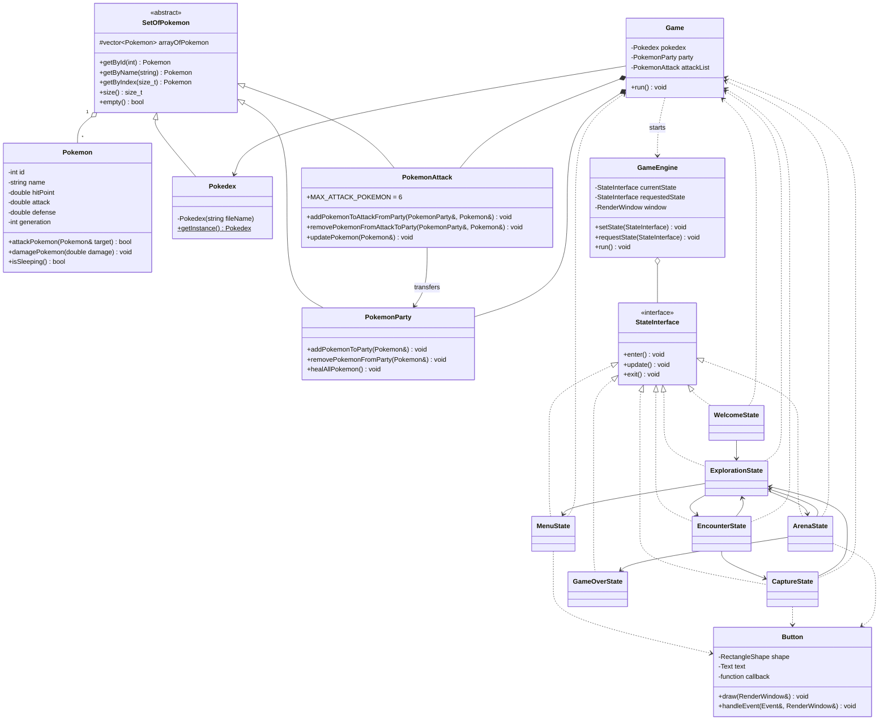

# TP Introduction C++ 

## Objectif

Ce projet d'introduction au C++ a pour but de se familiariser avec les différentes notions de base de ce langage. Il contient les premiers éléments pour créer une version simplifiée d'un jeu de Pokemon. 


## Classes

### Modèle Pokemon

- **`Pokemon`** : représente un Pokémon et ses statistiques (`HP`, attaque, défense, génération). Il gère les dégâts, les attaques et l'état endormi.
- **`SetOfPokemon`** : classe abstraite contenant une collection de Pokémon et fournissant les opérations communes de recherche, de consultation et d'affichage.
- **`Pokedex`** : collection singleton chargée depuis `Res/pokedex.csv`. Elle donne accès aux Pokémon par identifiant ou par nom.
- **`PokemonParty`** : équipe complète du joueur. Elle permet d'ajouter, retirer et soigner les Pokémon.
- **`PokemonAttack`** : équipe utilisée pour les combats. Elle est limitée à six Pokémon et permet les transferts avec la party.

### Moteur et interface

- **`Game`** : conteneur principal des données du jeu. Il possède la party et la liste d'attaque et partage le Pokédex singleton.
- **`GameEngine`** : gère la fenêtre SFML, la boucle principale et les transitions entre états.
- **`Button`** : composant graphique cliquable avec un texte, une zone interactive et une fonction callback.

### Etats du jeu

- **`StateInterface`** : interface commune des états avec `enter()`, `update()` et `exit()`.
- **`WelcomeState`** : écran d'accueil ; initialise les Pokémon de départ et permet de commencer la partie.
- **`ExplorationState`** : écran principal d'exploration ; donne accès au menu, à l'arène et aux rencontres sauvages.
- **`EncounterState`** : présente un Pokémon sauvage et propose de combattre ou de fuir.
- **`CaptureState`** : combat contre un Pokémon sauvage ; permet de choisir l'attaquant, d'attaquer, de consulter le journal et de capturer le Pokémon.
- **`ArenaState`** : écran de combat d'arène avec accès à l'exploration ou au game over.
- **`MenuState`** : permet de soigner la party, de consulter la party par pages et de gérer la liste d'attaque.
- **`GameOverState`** : affiche la défaite et le message lié à l'intimidation.

## Diagramme de classes




## Installations requises

- CMake 
- SFML 3


### Si SFML 3 n'est pas installée

Lors de la configuration, CMake cherche d'abord une installation locale. Si SFML 3 n'est pas trouvée, CMake la télécharge automatiquement depuis GitHub. Une connexion Internet est donc nécessaire lors de la première configuration.

Ensuite, reconfigurer et compiler :

```bash
cmake -S . -B build
cmake --build build --target Pokemon --parallel
```


## Compiler et lancer le projet

Les commandes doivent être exécutées depuis la racine du projet.

### macOS/Linux

```bash
cmake -S . -B build
cmake --build build --target Pokemon --parallel
cd build
./Pokemon
```

### Windows

```powershell
cmake -S . -B build
cmake --build build --config Debug --target Pokemon --parallel
cd build
.\Debug\Pokemon.exe
```

Le dossier `Res` est automatiquement copié dans `build/Res` après la compilation. Il faut lancer l'exécutable depuis `build/` (ou depuis `build/Debug/` avec Visual Studio).